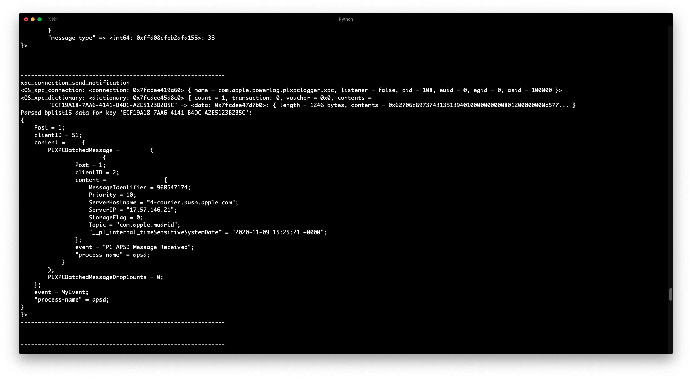

# xpcspy - Bidirectional XPC message interception and more

## Features:
* Bidirectional XPC message interception.
* iOS and macOS support.
* `bplist00`, and the infamous `bplist15` [deserialization].
* Filter by message direction (incoming or outgoing) and service name.
* More to come?


## Showcase
```
Usage: xpcspy [OPTIONS] [TARGET]

  Intercept XPC messages and more

Options:
  -U, --usb                 Use the USB-connected device instead of the local
                            one

  -p, --attach-pid INTEGER  Attach using the process' PID
  -f, --filter-by TEXT      Filter by message direction and service name.
                            'i' denotes incoming and 'o' denotes outgoing.
                            Service name can include the wildcard character
                            '*'. For exmaple 'i:com.apple.*',
                            'o:com.apple.apsd' or just 'o'/'i'.

  -r, --parse               Parse XPC dictionary keys that include either
                            `bplist00` or `bplist15` data.

  --help                    Show this message and exit.
```



## Installation
`pip3 install xpcspy`


## TODO:
* Add support for `bplist16`.
* Deserialize data within the parsed `bplist`s recursively.
* Improve script loading performance, kinda slow for some reason.
* Add an option to get the address, perhaps ASLR adjusted, for the XPC event handler, by spawning the process and hooking `xpc_connection_set_event_handler`.
* Add fancy colors.
* More pretty printing?


## FAQ 
* Why are you reinventing the [wheel]?
    * I'm not; XPoCe doesn't intercept incoming messages, and doesn't support `bplist00` or `bplist15`. 
    `

## License
[Apache License 2.0](LICENSE)

[wheel]: http://newosxbook.com/tools/XPoCe2.html
[deserialization]: http://newosxbook.com/bonus/bplist.pdf
